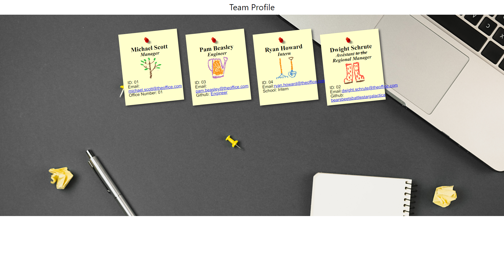

<h3 align="center">Team Profile Generator</h3>

  

    This project is a team profile generator created for school. After making the required app to the specifications, I plan to add more dynamic elements.
     
    <a href="https://github.com/404pandas/teamProfileGenerator"><strong>Explore the docs »</strong></a>
     
     
    <a href="https://github.com/404pandas/teamProfileGenerator">View Demo</a>
    ·
    <a href="https://github.com/404pandas/teamProfileGenerator/issues">Report Bug</a>
    ·
    <a href="https://github.com/404pandas/teamProfileGenerator/issues">Request Feature</a>
  

<!-- TABLE OF CONTENTS -->

  
Table of Contents

  <ol>
    <li>
      <a href="#about-the-project">About The Project</a>
      <ul>
        <li><a href="#built-with">Built With</a></li>
      </ul>
    </li>
    <li>
      <a href="#getting-started">Getting Started</a>
      <ul>
        <li><a href="#prerequisites">Prerequisites</a></li>
        <li><a href="#installation">Installation</a></li>
      </ul>
    </li>
    <li><a href="#usage">Usage</a></li>
    <li><a href="#roadmap">Roadmap</a></li>
    <li><a href="#contributing">Contributing</a></li>
    <li><a href="#license">License</a></li>
    <li><a href="#contact">Contact</a></li>
    <li><a href="#acknowledgments">Acknowledgments</a></li>
  </ol>

## About The Project

In past assignments, I have lost points for taking the base assignment and adding extra things on top of it to experiment with code. I plan to submit this assignment with the base requirements before adding onto it and playing around with node.js and inquirer.

(<a href="#readme-top">back to top</a>)

### Built With

(<a href="#readme-top">back to top</a>)

<!-- GETTING STARTED -->

### Getting Started

Read the information below for a guide on how to use this app.

## Prerequisites

Inquirer

## Installation

Clone the repo  
`git clone https://github.com/404pandas/teamProfileGenerator.git`

(<a href="#readme-top">back to top</a>)

<!-- USAGE EXAMPLES -->

## Usage

(<a href="#readme-top">back to top</a>)

<!-- ROADMAP -->

## Roadmap

- [ ] Add more dynamic elements
- [ ] Add audio?

See the [open issues](https://github.com/404pandas/teamProfileGenerator/issues) for a full list of proposed features (and known issues).

(<a href="#readme-top">back to top</a>)

<!-- CONTRIBUTING -->

## Contributing

Contributions are what make the open source community such an amazing place to learn, inspire, and create. Any contributions you make are **greatly appreciated**.

If you have a suggestion that would make this better, please fork the repo and create a pull request. You can also simply open an issue with the tag "enhancement".
Don't forget to give the project a star! Thanks again!

1. Fork the Project
2. Create your Feature Branch
   `git checkout -b feature/AmazingFeature`
3. Commit your Changes
   `git commit -m 'Add some AmazingFeature'`
4. Push to the Branch
   `git push origin feature/AmazingFeature`
5. Open a Pull Request

(<a href="#readme-top">back to top</a>)

<!-- LICENSE -->

## License

This project is licensed under the MIT license.
See LICENSE.txt for more information.

(<a href="#readme-top">back to top</a>)

<!-- CONTACT -->

## Contact

Mary Elenius - mary.panda.jackson@gmail.com

Project Link: [https://github.com/404pandas/teamProfileGenerator](https://github.com/404pandas/teamProfileGenerator)

(<a href="#readme-top">back to top</a>)

<!-- ACKNOWLEDGMENTS -->

## Acknowledgments

Collaborators on this project included instructional staff, TAs, and students from University of Central Florida.

A special thanks to my daughter, Yennefer. Every day she proves she is small but mighty!

(<a href="#readme-top">back to top</a>)

